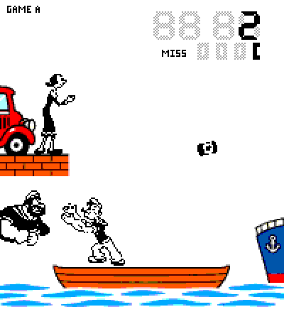

# Popeye G&W

A fan-made LCD catch game for **Pebble Time 2**, based on Nintendo's
**Popeye Wide Screen PP-23 (1981)**. Olive throws food beside her car on the
left; Popeye catches it in his boat while Brutus threatens him with a hammer
from the left pier or a fist from the right ship. The PT2 scene uses crisp
black segments, a white field, and vivid red, orange, blue and turquoise.

<p align="center"></p>

*Real gameplay from the Emery emulator (a sped-up highlight, shown at half of its 2x size).*

**Status:** Version 1.4.0 is published on GitHub and the Pebble App Store.
It adds Olive's kiss for a new best, on the clock hour and on Valentine's Day, and
a barrel for the lane 2 food; see the [release record](docs/releases/1.4.0.md).

**Download:** [Pebble App Store](https://apps.repebble.com/e9cb2950ca21440798fb1db8) ·
[GitHub release v1.4.0](https://github.com/ewijaya/popeye-gw/releases/tag/v1.4.0)
([PBW](https://github.com/ewijaya/popeye-gw/releases/download/v1.4.0/popeye-gw.pbw)).
Both downloads match the approved SHA-256 recorded in the [release record](docs/releases/1.4.0.md).

This is a watch adaptation, not an exact ROM recreation. The
[fidelity ledger](docs/pp23-fidelity.md) separates confirmed rules from provisional
timing, paths and input behavior. The app name is **Popeye G&W**; the
repository/package/build slug is `popeye-gw`. More: the archived PRD (`git show v1.0.2:PRD.md`),
[repository conventions](CLAUDE.md), [1.0.0 store description and checks](docs/releases/1.0.0.md),
[PT2 play-test checklist](docs/pt2-playtest.md) and [results](docs/pt2-playtest-results.md),
[M5 notes](docs/m5-notes.md) and [audit](docs/m5-audit.md). Earlier scene/M3/M4 audits
describe their historical builds.

## Features

- **Game A and B**: catch food for one point; two drops or a Brutus hit make one MISS, and three MISS end
  the round. Misses clear at 200/500, and pace resets every 100 points. A keeps Brutus on the left; B
  has a single Brutus who changes sides. Separate best scores.
- **LCD clock** that follows the watch's 12/24-hour setting and demonstrates a full throw, flight and catch.
- **Daily alarm** that wakes the closed app, with a bell animation and pulses.
- **Vertical or Horizontal** play, with the buttons below or above the screen (see below).
- Settings for swapped controls, vibration (respects Quiet Time), ghost segments and the clock demonstration.

### In development for 1.1 (not yet released)

- **Sound**: short square-wave LCD beeps for catches, drops, bonuses, game over, new bests and the alarm
  (Settings → Sound: Off, Low, Medium or High; default Medium). They follow the watch's speaker mute and Quiet Time.
- **Sprint** and **Daily**: 60 seconds of Game B rules, counted in active play time (pausing and MISS
  recovery do not use it), with a beep and pulse at 10 seconds left. Sprint is random; Daily gives
  everyone the same food and Brutus pattern on a given date, and every attempt counts toward the day's best.
- **Stats** (Menu → Stats): games, catches, drops, Brutus hits, bonuses, longest catch run and play time.
- **Hold-to-preview best score**: on the clock, hold Select to see Game A's best, keep holding for Game B's,
  and release to start the mode shown (tap is still A, hold is still B).
- **5-minute return**: the game-over screen goes back to the clock after five minutes without a button press.
- **App Glance**: the launcher shows both bests, today's Daily score once played, and the alarm time while it is on,
  for example "Best A 214 / B 187 / Daily 42 - 07:00".
- **Online leaderboard** (optional, **off by default**; Settings → Online): your best Daily round of the day is
  sent through the phone, and a server would replay your inputs with the real game engine to check the score.
  **The server is not deployed**, so with Online on the watch shows `Online: not sent`. What the server does
  and does not prove, privacy and how to run it: [server/README.md](server/README.md).
- A companion watchface, **Popeye G&W Clock**, is a separate package (see below).

Formats, persist keys, the replay encoding and measurements are in [docs/v1.1-notes.md](docs/v1.1-notes.md).

## Help

The same quick reference is on the watch under **Menu → Help** (seven short pages). In portrait, Select is
the middle button on the right. In landscape it is the middle of the three buttons above or below the screen.

| From / topic | Button or rule | What happens |
|---|---|---|
| Clock: Game A | Tap Select | Start Game A. Brutus attacks from the left. |
| Clock: Game B | Hold Select | Start Game B. Brutus changes sides. |
| Clock: best score (1.1) | Press and hold Select | Pressing shows Game A's best with HI; holding past 0.6 s switches to Game B's best. Releasing starts the mode shown. |
| Clock: high scores | Up in portrait; Left in landscape | Show saved scores. |
| Clock: menu | Down in portrait; Right in landscape | Open Daily, Sprint, High scores, Stats, Alarm, Settings, Help or About. |
| Playing: move | Up / Down in portrait; Left / Right in landscape | Move one pose per press. Swap reverses movement. |
| Playing: pause / resume | Select | Pause; press again to resume. |
| Quit a running game | Back twice | First pause, then return to the clock. |
| Catch food | Reach its matching catch pose | Add one point. |
| Center pose | Stand upright | Safe from Brutus, but cannot catch food. |
| Dropped food | Two drops | Add one MISS; the first drop shows a half-can. |
| Brutus hit | Get hit | Add one MISS. |
| Game over | Three MISS | The round ends. After 5 minutes with no button press the app returns to the clock (1.1). |
| Menu: Daily, Sprint (1.1) | Select | 60 s of Game B rules: Daily with today's shared pattern, Sprint with a random one. The pause title shows the seconds left; a beep and pulse warn at 10 s; at 0 the round ends with "Time up!". |
| Menu: High scores (1.1) | Select; movement buttons | Page 1 Game A and B; page 2 the Sprint, Daily and today's Daily bests; page 3 today's Daily score and the Online row. Reset clears all of them. |
| Menu: Stats (1.1) | Select; movement buttons | Three pages of lifetime totals. Select on the last page offers Reset stats; high scores are untouched. |
| Settings: Orientation (1.0.1) | Select Orientation, choose Vertical or Horizontal, then Select | Change screen orientation. Back cancels. |
| Settings: Buttons (1.0.1, Horizontal only) | Select Buttons | Toggle Bottom / Top. The choice is remembered in Vertical mode. |
| Settings: Swap | Select Swap | Reverse game movement. |
| Settings: Theme (1.2) | Select Theme | Switch the LCD colors between Classic and Ivory, the companion watchface's palette. |
| Settings: Sound (1.1; levels 1.3) | Select Sound | Cycle the LCD-style beeps Off → Low → Medium → High (default Medium). |
| Settings: Light (unreleased) | Select Light | Toggle In play / Auto. In play (default for new installs) keeps the backlight on while a round runs; pausing, game over, the menu, a notification or leaving the app hands it back to the watch. Auto leaves it to the watch's own backlight settings; players with settings saved by an earlier version start on Auto. |
| Settings: Online (1.1) | Select Online | Off by default. When On, your best Daily round of the day is sent through the phone to a leaderboard server (needs the phone and internet). High scores page 3 shows `Online #12/140`, `Online: not sent` or `Online: off`. The server is not live yet. |
| Help pages | Select; movement buttons; Back | Select advances, movement buttons browse both ways, Back returns to the menu. |

### Quick Launch tip

To open Popeye G&W from the watchface with one button, assign it on the watch: **Settings → Quick Launch**,
select the button you want, then choose Popeye G&W. After that, press and hold that button (about two
seconds) on the watchface. The last Help page repeats this; Pebble's
[Quick Launch article](https://help.repebble.com/en/articles/14490338-quick-launch) has the details.

## Playing

| State | Up / Down | Select | Hold Select | Back |
|---|---|---|---|---|
| Clock | High scores / Menu | Game A (shows best A while held) | Game B (best B shown) | Exit |
| Playing | Move Popeye one pose | Pause | — | Pause |
| Paused | — | Resume | — | Quit to clock |
| Game over | Move Popeye | Play again | Other mode | Clock |
| Menu | Move selection | Choose / toggle | Choose | Return |
| Alarm time editing | Increase / decrease | Save | Save | Cancel |
| Alarm ringing while idle | Stop | Stop | Stop | Stop |

The clock uses all four digits and demonstrates a complete throw/flight/catch sequence in two-second poses.
All four food arcs appear over 48 seconds. With attract animation disabled, it shows static poses and a
steady colon and updates once per minute. Clock ticks stop on other pages and while the app is out of focus.

A daily alarm uses Pebble Wakeup to launch the closed app. After firing, it schedules the next local
calendar day. A scheduling conflict gets one retry a minute later; the Alarm page shows the adjusted time or
a visible error with Retry. Hour/minute editing uses 24-hour values: Select saves, Back cancels. Test alarm
previews the bell animation without changing the daily schedule. While idle, an alarm animates Olive's bell
and pulses every two seconds for up to a minute; any button dismisses it. During play, the bell flashes and the
watch pulses once while the game keeps running. Vibration respects both the app setting and Quiet Time.

A catch lights its final cargo segment and a catch flash for one step; a miss blinks its splash/dizzy pose
through recovery. Bonuses flash MISS, and game over flashes the score and any new-best HI. Misses/bonuses give
a short pulse; game over gives a long pulse, followed by two short pulses for a new record. All flashing finishes
after 1.5 active seconds. The owner confirmed physical-watch controls, hit feedback, alarms and Quiet Time in the
recorded PT2 play-test.

Settings, high scores and stats use separate versioned, checksummed byte records. Missing, corrupt or unknown
records fall back to defaults independently. Writes happen at pause, game over, focus loss and exit, avoiding a
flash write for every catch. Reset requires a second selection, with Keep scores selected by default. Save
failures are visible. The unchanged UUID preserves records across app updates.

## How it works

`src/c/game.c` and `game.h` have no platform dependencies. `game_init` starts a round; `game_input` handles
press/release edges immediately; `game_advance` consumes active milliseconds; `game_step` advances to the next
boundary for simulation. Pacing values live in `src/c/tuning.h`. `src/c/scene.c` turns game state into the
PRD 9.2 set of lit segments plus Olive's kiss, 89 in all (pure C99, host-tested). `src/c/view.c` draws each segment from a packed sprite
sheet using positions generated into `src/c/segments.h`; only unlit digit/MISS registers have baked grey ghosts.
`src/c/main.c` runs one `AppTimer` per step or recovery and none while paused, over or in the clock. A separate
presentation timer finishes a bounded 1.5-second feedback sequence and then stops. Pausing keeps the elapsed
part of the current interval, and losing focus pauses a running game.

The [PP-23 ledger](docs/pp23-fidelity.md) records the manual and recording observations. The numeric timing
table, five player poses, four food arcs, spawn scheduler and precise miss/input behavior remain provisional.

## Host tests

```sh
./tools/test.sh
./tools/test.sh --sanitize
```

The runner uses `/usr/bin/cc`, strict C99 warnings, and a temporary output
directory. It covers the game rules, the mapping from game state to lit
segments (`src/c/scene.c`), and an independent perfect-player bot over
10,000 seeds in each mode through 1,000 points. The second command enables
address and undefined-behavior sanitizers. The M4 suite tests versioned records,
corrupt data, write failures, 12/24-hour clock segments, calendar/DST rollover,
alarm conflicts and wakeup delivery using the real adapters with a small SDK
fake. It runs in UTC and America/New_York. Both commands run on every push and
pull request; neither requires the watch SDK. The M5 suite covers every attract
food position, alarm override, finite flashing, pause/resume, delayed callbacks,
timer allocation failure and haptic priority/settings/Quiet Time.

The fairness bot verifies 20,000 seeded games through 1,000 points, including side changes and resets; the
timed modes are checked over 10,000 seeds through time-up. The suite also covers the replay format, the
leaderboard server and the GIF writer in `tools/make_gif.py` (below).

## Handheld orientation

In **1.0.1**, open **Menu → Settings → Orientation**. Choose **Vertical** or
**Horizontal**, then press Select to save; Back cancels. Orientation is the first
Settings item. **Buttons: Bottom / Top** appears beneath it only in Horizontal
mode. Select toggles button position, which is remembered when switching to
Vertical and back, including after reopening. Bottom is the initial horizontal
preference; existing horizontal Top/Bottom selections are preserved on upgrade.

Turn the watch clockwise for Bottom (buttons below) or counterclockwise for Top
(buttons above). Left moves left, middle starts/pauses, right moves right
(unless Swap is on). The clock, alarm and menus follow the chosen orientation.

On older **1.0.0** installations, use **Settings → View** and cycle
**Portrait → Bottom → Top**. Portrait is vertical; Bottom and Top are horizontal.
See [landscape mode](docs/landscape.md) for details and screenshots.

## Art

The complete inventory includes five player poses, two dizzy poses, catching
feedback, fixed Olive ready/throw poses, two bell frames, one rival with
left-hammer/right-fist phases, four food arcs with five positions each,
splashes, MISS cans, digits and indicators. There are no rectangle
placeholders in the renderer.

Character animation and cargo sources were created with the built-in image
generation tool. Repeated positions and mirrored poses share those sources;
small UI symbols use geometric artwork. Prompts and preparation instructions
are in [art/source/README.md](art/source/README.md). The 1981-style PT2 advert,
store icons, source prompts and native screenshot set are linked from
[art/store/README.md](art/store/README.md).

```sh
# Only when changing source art; requires ImageMagick.
python3 tools/prepare_art.py
# Pack the committed runtime segments; Python standard library only.
python3 tools/build_art.py
python3 tools/build_art.py --check
```

The art check rejects missing, unexpected, empty or opaque full-screen
segments, and validates the 25 × 25 launcher icon. Host tests check all 89
generated entries, screen bounds, atlas bounds and non-overlapping atlas crops.

## Gameplay GIF

`docs/media/gameplay.gif` was captured from the Emery emulator: frames from the QEMU monitor's `screendump`
while driving the buttons, then merged into a GIF by `tools/make_gif.py` (Python standard library only; at most
64 colours, identical frames merged, only changed areas stored). Example: `python3 tools/make_gif.py --fps 12
--scale 2 -o docs/media/gameplay.gif frames/*.ppm`.

## Build

Requires Pebble Tool 5.0.40 and SDK 4.33.1. Use the bundled compiler.

```sh
pebble clean
pebble build
pebble install --emulator emery build/popeye-gw.pbw
```

Check the exit status and the literal `'build' finished` in the build output.
Every SDK build checks `.text + .data + .bss` against the **61,440-byte** app
budget and fails if it exceeds that limit. The playable app links the game
engine and loads the complete art set. The bundle is named `popeye-gw.pbw`
regardless of the checkout directory name, so pass its path when installing.

### Leaderboard server and phone code

`server/leaderboard.py` (Python 3 standard library) and `tools/replay_verify.c` (a native verifier
built from the real `game.c` and `replay.c`) are tested by `./tools/test.sh`. The phone side is
`src/js/pebble-js-app.js` (PebbleKit JS, `enableMultiJS: false`; the SDK build needs no Node).
`tests/test_pkjs.py` runs its tests with Node when a working `node` exists and skips with a message
otherwise. Nothing is deployed.

## Companion watchface

`watchface/` is a separate Pebble project, **Popeye G&W Clock** (`popeye-gw-clock`,
Emery only). The default **Everyday** preset shows local time, date and battery,
with continuous fixed-pose animation for Olive, Popeye and Brutus. Phone settings
use an offline Clay form: open **My Apps → Popeye G&W Clock → Settings** in the
Pebble phone app. Choose Classic, Everyday, Traveller or Large Time,
then adjust the information rows, animation, colours and accessibility options.

The two rows can show date, battery, optional weather, daily steps, world time
or an event countdown, with optional rotation. Weather uses Open-Meteo and needs
explicit opt-in plus a phone Internet connection; world time uses bundled IANA
rules for daylight saving time. Cached data shows a stale marker. Themes,
custom colours, ghost strength, larger time and reduced motion are configurable.
Motion pauses while covered, in Quiet Time or configured quiet hours, and at
the chosen battery cutoff off power. The colon stays steady unless blinking is
enabled. The second row uses symbols and values, with text retained for world
locations. Connection indicators and decorative weather effects are omitted;
there is no sound or disconnect vibration.

It shares the game's `scene.c`, `clock.c`, `game.c` and artwork by path, and has
its own settings and UUID. **Version 1.0.3 is published**, with a fuller Still scene
([release record](docs/releases/clock/1.0.3.md)):
[download the watchface PBW from GitHub](https://github.com/ewijaya/popeye-gw/releases/tag/clock-v1.0.3)
or install it from the [store listing](https://apps.repebble.com/8e8e130581e7467d9d7b0138).
GitHub and the general/Emery store catalog downloads match the owner-approved
frozen build, and the store page and [changelog](https://apps.repebble.com/popeye-g-w-clock_8e8e130581e7467d9d7b0138/changelog)
list 1.0.3. Detailed
physical edge cases remain documented in the device checklist. See the [implementation notes](docs/watchface-implementation.md),
[feature scope](docs/watchface-features.md) and
[device checklist](docs/watchface-playtest.md).

```sh
cd watchface
npm ci
./test.sh
./test.sh --sanitize
pebble clean
TERM=xterm pebble build
pebble install --emulator emery build/popeye-gw-clock.pbw
```

Use a working Node runtime for dependencies and phone tests. Set
`WATCHFACE_NODE=/path/to/node` for the test runner if necessary. The separate
bundle is `watchface/build/popeye-gw-clock.pbw`; the game's root build does not
include it.

## Licence

See [LICENSE](LICENSE) for the repository licence.
