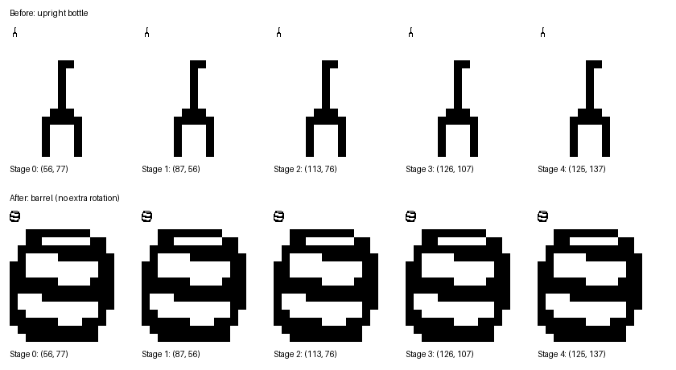
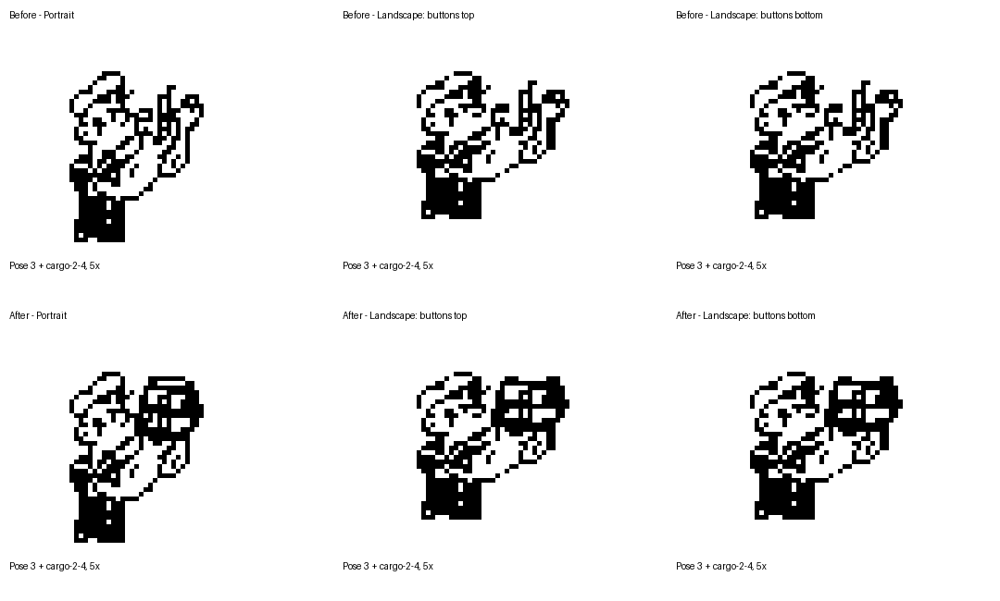

# Lane 2 barrel art audit

Archive note: The barrel landed on main as `dc6310b`, and the companion clock
reached version 1.0.1. The baseline and build measurements below describe the
original audit; its local logs are archived under
`.release/archive-worktrees/popeye-gw-watchface/.release/lane2-barrel/`.

Date: 2026-10-07. Baseline: `055db24` game artwork and sources.

Lane 2 now uses the existing `art/source/barrel.png` (prompt recorded in
`art/source/m3-prompts.json`). Lane 0 keeps its tilted bottle. The lane 2
14 × 14 sprite window, five arc positions and additional rotation of 0° are
unchanged. No new source art was generated.

## Visual inspection

Each of the five stages was composited onto white and inspected at native size
and 10× nearest-neighbor enlargement. The barrel's wide silhouette and hoops
remain readable at 14 px and distinguish it from lane 0's bottle.



Pose 3 with `cargo-2-4` was reconstructed from the generated atlas and segment
table for portrait and both landscape layouts. The barrel meets Popeye's raised
hands in all three. Landscape crops below are rotated into their viewing
orientation; all catch crops are enlarged 5×. These are art composites, not
emulator screenshots.



## Regeneration and scope

Ran the repository tooling in order:

```sh
python3 tools/prepare_art.py
python3 tools/build_art.py
python3 tools/build_art.py --check
```

The check passed for all 82 segments. Only the five `art/segments/cargo-2-*.png`
images have changed pixels. The three atlases and their segment tables were
regenerated, with no manual table edits. Comparing every decoded atlas entry
against the baseline confirmed that only these five sprites changed in each
orientation; other screen positions, dimensions and pixels are unchanged.
Packing offsets changed as the atlas was repacked. Pixel-identical source
outputs were restored to avoid unrelated PNG metadata changes.

Hashes of `src/c/game.c`, `src/c/game.h` and `src/c/tuning.h` are unchanged.
Lane count, timing, fairness and scoring were not edited.

## Tests and SDK build

- In the shared working tree, both `CC=/usr/bin/cc ./tools/test.sh` and its
  `--sanitize` variant stopped at two existing release-helper test failures:
  `test_app_selection_and_candidate_isolation` and
  `test_clock_identity_registration_and_upload`. Earlier uncommitted Clock work
  sets the store app ID, while these tests expect it to be absent. Those files
  were left untouched by this change.
- Both commands passed in an isolated checkout of the baseline plus only this
  art change. This includes the normal and sanitizer C suites, 10,000 fairness
  seeds per game mode through at least 1,000 true points with zero unavoidable
  misses, scene tests, and the offline watchface/configuration suites. Each
  release-helper run reported 14 tests with two skips.
- Before and after: `pebble clean` followed by `TERM=xterm pebble build` using
  Pebble SDK 4.33.1's bundled ARM compiler. Both builds exited 0 and contained
  the literal `'build' finished successfully`. Both had the existing linker
  warning about a LOAD segment with RWX permissions.
- PBW identity matches the unchanged root game manifest: version 1.0.2,
  Emery only, watchapp. `game_advance`, `game_input`, `game_start` and
  `game_step` remain linked in the ELF.

All sizes are bytes. App image is the SDK's `arm-none-eabi-size` **dec** column,
not the ELF file size.

| Measurement | Before | After | Change |
|---|---:|---:|---:|
| `.text` | 19,388 | 19,388 | 0 |
| `.data` | 60 | 60 | 0 |
| `.bss` | 952 | 952 | 0 |
| App image (`.text + .data + .bss`) | 20,400 | 20,400 | 0 |
| Headroom below 61,440-byte app budget | 41,040 | 41,040 | 0 |
| `app_resources.pbpack` | 25,969 | 26,146 | +177 |
| `popeye-gw.pbw` | 48,636 | 48,813 | +177 |

Resource and PBW sizes also remain below the repository's 200,000-byte and
2,000,000-byte budgets. Local build logs, test logs, baseline outputs and PBWs
are retained under the ignored `.release/lane2-barrel/` directory.

## Emulator limitation

The baseline PBW installed, but starting the requested app through
`pebble gdb --emulator emery` failed with a WebSocket connection reset. One
restart and reinstall produced the same failure. No before/after lane 2 game
screenshots or runtime heap measurements were obtained. The comparisons above
verify generated artwork and placement; an emulator/device play-test remains
unverified. No version bump or publication was performed.
