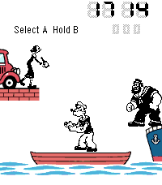
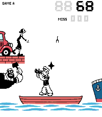
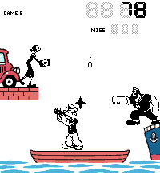
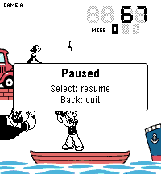
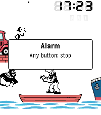

# Popeye G&W 1.0.0 — release record

Approved on 2026-10-05. GitHub is published and verified; RePebble registration
is pending after a server error. See the publication record below.

## Approved listing

| Field | Value |
|---|---|
| Name | Popeye G&W |
| Author | Edward Wijaya |
| Version | 1.0.0 |
| Type / category | Watchapp / Games |
| Hardware | Pebble Time 2 (Emery) only |
| Visibility | Listed |
| Website / source | https://github.com/ewijaya/popeye-gw |
| Web Help | https://github.com/ewijaya/popeye-gw#help |
| Companion apps | None |
| Large icon | [144 × 144](listing/icon-144.png) |
| Small icon | [80 × 80](listing/icon-80.png); [48 × 48](listing/icon-48.png) also preserved |
| Banner | [720 × 320 approved artwork](listing/banner-720x320.png) |
| GitHub destination | Proposed release `v1.0.0` in `ewijaya/popeye-gw` |
| Store destination | RePebble, first registration if Dashboard discovery finds no UUID/repository match |

## Store description

A whole childhood on one small screen.

There was a time when a whole afternoon could fit in your hands. A little boat, a few black shapes, and the solemn promise that this would be your last game before dinner. Then one more catch. One more try.

Popeye G&W returns to the harbour of Nintendo's 1981 Wide Screen handheld. Olive Oyl stands beside her car, tossing food across the water. Popeye reaches from his rowboat. Brutus waits for you to lean a little too far. The figures move in those familiar little jumps, and you remember how much could happen with so few pictures.

Play Game A or B, turn the watch sideways, and leave your best score for tomorrow. Between games, the harbour keeps time, with a daily alarm to bring you back to the present.

Somewhere, it is still the afternoon you didn't want to end.

An unofficial fan adaptation for Pebble Time 2, with vivid scenery, saved scores and gentle vibration cues. Runs entirely on the watch. Gameplay is adapted for Pebble; this is not an exact emulation.

Controls and Help: https://github.com/ewijaya/popeye-gw#help

The description is 1,077 characters. The requested essay style expands the
repository's earlier approximately 500-character draft. It stays below the
[legacy Pebble submission guide's 1,600-character limit](https://developer.rebble.io/guides/appstore-publishing/preparing-a-submission/).
The live Dashboard's current constraints still need checking before submission.
The Help table is in the public README, where Markdown tables render directly;
the store text links to it without relying on table support in the store itself.

## Screenshot gallery

Five captures of the exact release binary. Landscape images below are upright,
lossless rotations of their 200 × 228 originals; no pixels were redrawn or resized.

| Order | Scene | Presentation | Native original |
|---|---|---|---|
| 1 | Clock and harbour, Bottom landscape | 228 × 200 | [Native](listing/native/01-clock.png) |
| 2 | Game A: catching food, left hammer threat | 200 × 228 | [Native](listing/native/02-game-a.png) |
| 3 | Game B: catch and right-side Brutus strike, Bottom landscape | 228 × 200 | [Native](listing/native/03-game-b.png) |
| 4 | Pause/resume controls over Game A | 200 × 228 | [Native](listing/native/04-paused.png) |
| 5 | Daily alarm with Olive ringing | 200 × 228 | [Native](listing/native/05-alarm.png) |

This gallery proposal replaces PRD 9.4's game-over/HI image with pause/resume
controls. That substitution, the longer description and the 80-pixel small-icon
export are included in the listing for owner review; the PRD has not been silently
rewritten. The approved banner and runtime art are unchanged.

A/B scores and food positions were staged in the debugger for composition;
they are examples, not earned scores. The pause capture uses the real pause
control. Clock and alarm use their running app states. Exactly five native
captures were taken. Original emulator scores (A 1 / B 0), dates and Bottom
settings were restored and the debugger detached; no physical-watch settings
were manipulated for screenshots.

## Candidate and checks

- Build source: `453e59d` (clean preparation commit; later gallery/review edits do not change app code).
- Frozen candidate path: `.release/1.0.0/popeye-gw.pbw`.
- SHA-256: `79c82ea63923f9f3aa23724a99f45952a7602d7c9c9106349a427e88ee05c046`.
- This PBW is byte-for-byte identical to the Help build already installed on the
  owner's PT2 (`c2e7270d36ef`); all four ZIP entries are identical too.
- Release notes: [CHANGELOG 1.0.0](../../CHANGELOG.md).

| Check | Result |
|---|---|
| Host suite / ASan + UBSan | Both pass; 10,000 seeds per mode, zero unavoidable misses |
| Clean SDK build | Exit 0 and literal `'build' finished`; Tool 5.0.40 / SDK 4.33.1 |
| App image | 19,752 / 61,440 bytes; 41,688 bytes headroom |
| PBW / resources | 48,091 / 26,040 bytes; both within budgets |
| Emulator heap A, portrait | 45,372 free / 65,948 used; 40.76% free |
| Emulator heap B, Bottom | 45,136 free / 66,184 used; 40.55% free |
| Engine retained | All six gameplay entry points linked; this is the complete playable app |
| Identity | Correct UUID, name and version; Emery-only watchapp |
| Launcher icon | Unchanged 25 × 25 pixels; prior native launcher inspection applies to identical icon bytes |
| Screenshot checks | Five inspected captures; landscape rotations verified against native originals |
| Cleanup | Build environment locks removed; debugger detached; owned logger stopped |
| PT2 acceptance | Core M5 and Bottom accepted; owner approved this exact installed candidate for publication on 2026-10-05; no new per-check measurements |

The linker retains its existing SDK RWX LOAD-segment warning. Physical input
latency and exact Nintendo timing remain unmeasured; no new fidelity claim is made.

## Publication record — 2026-10-05

The owner approved this exact frozen PBW, the full proposed listing and both
destinations with **“I approve.”** The reviewed snapshot remains frozen locally
in `.release/1.0.0/review.md`; no app code, binary, description or artwork was
changed during publication.

| Destination | Status |
|---|---|
| [GitHub release v1.0.0](https://github.com/ewijaya/popeye-gw/releases/tag/v1.0.0) | Published; not a draft or prerelease. Downloaded PBW is 48,091 bytes and matches the approved SHA-256 above. Notes match the frozen text. |
| RePebble App Store | Pending. One Dashboard submission returned **HTTP 500: Unable to process request**. The recovery Dashboard remained at “Loading apps”, and public UUID lookups timed out. No assigned App ID or public listing has been confirmed. |

The annotated `v1.0.0` tag points to
`fbf3dbd974e3da111700b0cbf1f840fcf9ded6a2`; its CI passed. That commit adds
only gallery/review documentation after the audited clean build source listed
above. GitHub serves the frozen bytes, without a rebuild.

Before submission, the owner's Dashboard contained only KasugaBus and
Orationes; neither was changed. The live form accepted the 80 × 80 and
144 × 144 icons and 720 × 320 banner. It requires **200 × 228** Emery
screenshots, so the submitted gallery uses the five approved **native** files
linked above: three portrait scenes and two landscape scenes displayed in the
watch's native orientation. The owner was informed of this constraint; upright
landscape exports remain in this web gallery. All five files were accepted by
the form in the documented order.

The submitted fields are Popeye G&W, Games, listed, Emery watchapp, version
1.0.0, the exact approved description and release notes, both website/source
set to the GitHub repository, and no companion apps. There is no Clay phone
configuration page in 1.0.0; settings and alarm controls are on the watch.
These are the submitted values, not a claim of verified server persistence.

Recovery state is saved in `.release/registration.json` as `uncertain`, with
the approved frozen artifacts and listing hashes in `.release/1.0.0/manifest.json`.
Do not submit New again until read-only discovery can rule out a partially
created listing. Resume with these same frozen bytes when the store responds;
record its assigned ID immediately, then verify the general and Emery catalog,
public listing, notes, artwork and downloaded PBW hash. M6 remains pending
until the store verification passes.
