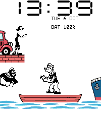
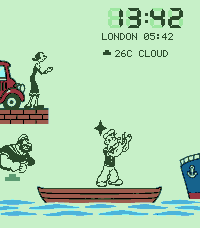
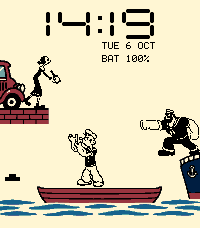
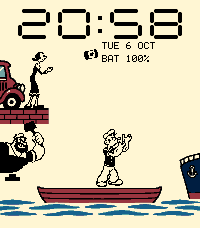
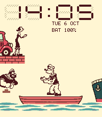
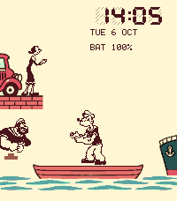
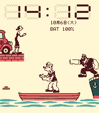
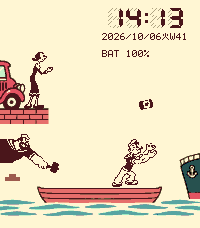

# Rich watchface development audit — 2026-10-06

The current development artifact is the [display-polish build](#display-polish-follow-up)
recorded below. The initial rich-build figures and feedback are retained as history.

Implemented the [approved feature scope](watchface-features.md) with three
GPT-6.1-Sol agents at xhigh reasoning, followed by integration and final review
by the orchestrating agent. The shared game sources, artwork, root package,
root build script, game tests and PRD are unchanged.

This is an **unreleased development build**, from a dirty `feat/watchface`
tree based on `5e5a87655d728fa47a960e4f4800f325004bfb35`. It is not a frozen
release candidate. No commit, push, tag, release or store update was performed.

## Build and tests

| Check | Result |
|---|---|
| Toolchain | Pebble Tool 5.0.40; SDK 4.33.1; Node 20.19.5 |
| Full normal host suite | Passed, including both 10,000-seed game fairness runs |
| Full ASan/UBSan host suite | Passed, including both fairness runs |
| Final watchface ASan/UBSan suite | Passed: animation, settings, persistence format, calendar and data lifecycle |
| Phone/configuration tests | All 19 passed; actual Clay HTML, presets, queue retries, stale caches, C/F changes, DST and offline/error cases |
| Uploader tests | All 14 passed with the installed SDK and fake transport; no store requests |
| Clean SDK build | Exit 0 and literal `'build' finished` |
| C app image | 21,639 / 61,440 bytes; 39,801 bytes headroom |
| Resource pack | 9,424 / 200,000 bytes |
| PBW | 1,135,099 / 2,000,000 bytes |
| Runtime emulator heap at initialization | 60,236 bytes used, 49,188 bytes free; physical runtime heap unmeasured |
| Identity | Popeye G&W Clock, version 1.0.0, Emery only, `watchface: true` |
| UUID | `9f808f24-978d-4e7d-9af1-16bd31e4b8c5` |

PBW SHA-256:

```text
a683e7e36532e78b610fbfe66e5d327babc9ea93c8f8a16d339c9387dab2eac9
```

Artifact: `watchface/build/popeye-gw-clock.pbw`. The linker keeps the shared
lane/scene helpers and removes unused game-engine functions. JavaScript source
maps remain in local build output and are excluded from the PBW by a Waf hook;
neither the SDK nor the finished PBW is patched. The only clean-build warning
is the SDK linker's RWX LOAD-segment warning. Build lock files were removed
without reading their environment contents.

## Emulator and Clay evidence

- Default date and battery rows fit the upper-right space. Native captures
  show distinct character poses during continuous Lively animation.
- The actual Clay form renders all 48 controls, applies presets immediately,
  and enables/disables dependent controls correctly.
- Saving Large produced the native log `Settings preset=5 theme=0 rows=1/2
  mode=4`; the resulting large digits fit cleanly. Reopening Clay retained Large.
- A custom Green LCD layout saved world time and weather into the two rows.
  The watch logged `Settings preset=0 theme=2 rows=5/3 mode=2`.
- Manual `Tokyo, JP` weather fetched live data through the real phone JavaScript
  service. Reopened Clay reported a recent update, and the watch showed 26 C
  and cloudy conditions. London displayed 05:42 while Tokyo local time was
  13:42, consistent with the selected zone's daylight-saving offset.
- Five native 200 × 228 images were captured in total. Two representative
  development previews are preserved below. Listing screenshots still need
  recapture from the future frozen release candidate.

The stock SDK configuration proxy failed to deliver its local iframe callback
in Edge. A local-only harness served the unmodified generated Clay form and
its callback from the same origin, forwarding the saved response through the
normal SDK `webviewclosed` path. Edge showed `ERR_BLOCKED_BY_CLIENT` for the
completion page **after** delivery; native logs, changed layouts and reopened
controls confirm successful saves. No browser security setting was changed.

One emulator transport interruption required the allowed kill/restart recovery;
no wipe was used. Settings reverted during that recovery. Investigation found
that the SDK's Python `dbm.dumb` localStorage backend can leave an inconsistent
index after abrupt termination; an isolated backend test reproduced this.
Normal in-session reopening retained saved preferences. A later normal PBW
reinstall also retained the manual Tokyo location and London world-clock
choices in the subsequent Clay save. This recovery result is not evidence
of physical-phone persistence behavior.

| Large Time preset | Green LCD, world time and weather |
|---|---|
|  |  |

## Physical watch and remaining observations

The exact PBW above installed successfully through CloudPebble on 2026-10-06.
Asked to test My Apps → Popeye G&W Clock → Settings, save a preset, and assess
the more active cast, the owner replied **“Settings save works and motion feels
good.”** This confirms the normal phone settings flow and animation experience
on the rich build. Earlier “everything looks great!” feedback applies only to
the old minute-demo build.

Physical battery consumption, Health access, automatic-location permissions,
quiet/focus interruptions and extended lifecycle
checks remain on the [device checklist](watchface-playtest.md). These are not
claimed as passes from emulator or mocked tests. Weather and disconnect
vibration are off by default. Publication requires a separate frozen-build
review and owner approval.

## Display polish follow-up

Following the owner's physical-watch photo and feedback:

- Moved large clock digits, colon and AM/PM down eight pixels. The top segment
  now starts at y=9; large-mode information rows start at y=42 and y=55.
- Made Ivory the default in native settings, phone settings and all presets.
  Original, Green LCD and Amber remain selectable. Removed Midnight; existing
  Midnight preferences migrate to Ivory without resetting other settings.
- Made Faint ghosts substantially lighter with one ink pixel in four and
  channel rounding that avoids an orange cast on Ivory. The pattern is fixed,
  uses no extra timer or bitmap allocation, and applies to both clock sizes.
  Strong remains available; high contrast continues to suppress ghosts.
- The owner cancelled the battery test. No battery measurement was started.
- Separated layout/style presets from animation activity. Classic, Everyday,
  Traveller and Large preserve motion mode, speed, pauses, active characters,
  reduced motion and weather effects. Active is removed from the preset menu;
  old Active preferences retain their choices under Custom.
- Added Japanese date language with compact weekday kanji, natural month/day
  ordering and a numeric year/week form that fits the information panel.
- Tightened large-clock spacing after the owner's `14:19` photo: `1` now uses
  a narrow four-pixel shape instead of an empty full-width cell. Each number
  group sits eight pixels from the centered colon. Digit height and top inset
  are unchanged. Native `14:19` and `20:58` captures verify narrow and wide
  combinations; the emulator clock was restored to real time afterward.

Normal and ASan/UBSan watchface suites passed, including all 19 phone tests.
The final clean SDK build exited 0 with `'build' finished`; only the existing
SDK RWX-segment warning remains. Identity and resource size are unchanged.
Native screenshots confirm the top inset, clear information rows and lighter
ghosts at both clock sizes. The owner's subsequent physical `14:19` photo shows
the padded clock clear of the bezel; feedback on the final spacing is pending.

| Final polish artifact | Value |
|---|---|
| C app image | 22,503 / 61,440 bytes; 38,937 bytes headroom |
| PBW | 1,136,378 bytes |
| Resources | 9,424 bytes |
| Version | 1.0.0, development only |
| SHA-256 | `d231caf1039b828cc38c5b0b5c3b8b334763ccaed36ea95177b8280d3297ab76` |
| Physical install | CloudPebble reported success on 2026-10-06 |

Final spacing:




Earlier polish previews, before the spacing adjustment:








## Information readability and banner follow-up — 2026-10-06

Information rows now use 11px-tall LCD lettering (formerly7px), wider Latin
and Japanese glyphs, and a shared right ink edge at x195. The panel extends
left as needed to x60; short values sit at the right. Normal rows begin y33/52,
large rows y42/61. Battery and weather/step icons align with the row contents.
Moving cargo is cleared behind visible rows so it cannot obscure the text.
Native checks covered large English, Japanese with year/week and battery bar,
and compact English with year/week and spinach battery indicator. Final
large/Japanese captures are `previews/*readable-info.png` under the clock
release folder; compact capture predates only the cargo-clear fix.

Host scene/settings/data and all19 phone tests pass. A clean SDK build and
subsequent final render builds succeeded. Final app image22,859/61,440 bytes,
resources9,424 bytes. Both Emery and physical CloudPebble installs succeeded.
PBW SHA256: `209b8787d5b48a28eebf68823667091bc45db8274936b307ad355ac3c5ae77b8`.
Physical readability feedback on this exact build is pending.

The banner was redesigned with built-in image generation, preserving all
approved wording and using a fresh Classic Ivory native screenshot as the
screen reference. The 720×320 export was visually inspected; master, prompt
and previous archived versions are retained. No store publication occurred.


## Clock-edge alignment correction — 2026-10-06

Information rows now end at the final clock digit, rather than the screen
margin: compact exclusive right edge183; large edge returned directly by
the proportional digit renderer (normally182, follows narrow minute digits).
Text, icons and progress bars share this bound. Enlarged lettering retained;
long content uses the existing ellipsis behavior to stay within the panel.
SDK build passed, image22,919/61,440 bytes. Native large and compact previews
verified at `docs/releases/clock/previews/info-clock-edge-*.png`.
PBW SHA256 `b15b451669daa95b48bcf08f412082e2ccc5ea04417e5902662a13aa0d951677`.


## Information font replacement — 2026-10-06

Owner approved both clock-edge alignments but disliked uneven strokes from
fractional bitmap scaling. Replaced information text with native-size15px
Noto Sans JP Regular (SIL OFL1.1, TTF/license in watchface/resources/fonts).
SDK resource includes ASCII and seven Japanese calendar glyphs. Both layouts
retain the clock-digit right bound. Pixel status and seven-segment time remain.
Normal host/19phone tests passed; SDK builds succeeded. Native large English
and compact Japanese year/week + battery-bar previews inspected at
`docs/releases/clock/previews/info-sans-*.png`. Initial screenshot after first
install showed launcher; reinstall succeeded and subsequent config/render
checks worked. No emulator wipe/kill performed. Final cleanup removes unused
fractional scaling branch. Final image22,975/61,440 bytes, resources12,558.
PBW SHA256 `d8dd16bb26bc2a028e87afe89bd1f9222c5569ce328469f3546e9c5c9739e4ea`.


## Battery display options — 2026-10-06

Removed BAT text. Clay Battery display retains wire values0–3, now labeled
Percentage only, Battery icon only, Battery icon + percentage, Spinach can +
percentage. Native and phone defaults now2 (icon + percentage); existing saved
selections retained. Battery outline has four fill bars and sits left of the
percentage. A pixel lightning bolt at the right indicates charging in all four
styles. Font and final-clock-digit alignment retained. Native screenshots
verified all four styles at70% charging, including narrow large minute digits;
emulator battery restored to100% noncharging afterward. These are visual
checks only, not the cancelled battery-consumption test.
Host C suites and all19 phone tests passed; SDK build succeeded.
App image23,111/61,440 bytes; resources12,558 bytes.
PBW SHA256 `6631fc45bd7cf2db7cde1ef778af3ec3f468a29f9e2842dd780d1bad3bf0ecdf`.
